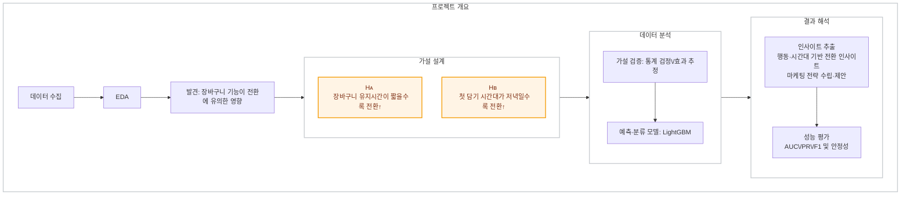

# 1️⃣ [프로젝트]**이커머스 데이터를 통한 장바구니 고객 행동 분석**

## 프로젝트 개요
| 항목             | 내용                                                                 |
|------------------|----------------------------------------------------------------------|
| 프로젝트 기간     | 2025.09 – 2025.12                                                    |
| 참여 인원        | 3명                                                                   |

## 참여인원 프로필

- 고성빈 : https://github.com/sbinhigher/sbinhigher
- 오새하 : https://github.com/saehao
- 김가현 : `깃허브 링크`

### 🔍 프로젝트 분류  
`이커머스 데이터 분석(E-commerce Analytics)` · `전환율 예측(Conversion Prediction)` · `행동로그 분석(Behavior Analytics)`

## 프로젝트 배경
- '장바구니 기능'이 이커머스 서비스에서 끼치는 영향력에 대한 검증
- 유저의 **담기 시간대/유지시간** 같은 행동 특성에 따라 전환률이 크게 달라질 수 있으나, 이를 정량 검증·예측하는 체계 부재

## 🚀 목표 및 성과  
| 항목 | 기존 | 개선 | 성과 |
|---|---|---|---|
| 타깃팅 전략 | 룰/일괄 캠페인 | **전환확률 기반 세그먼트** | 전환확률 스코어 산출 파이프라인 설계·구현 |
| 지표 관리 | 단일 정확도 중심 | **AUC, Precision/Recall, F1** 동시관리 | 전환/비전환 구분력 평가 지침 정립 |
| 가설 검증 | 정성적 추정 | **H1/H2 통계검정 + 모델 중요도 교차검증** | 분석 프레임 완성(일관성 체크 루틴) |
| 설명가능성 | 제한적 | **LightGBM 비선형 예측 모델의 변수 중요도** | 통계검정 기반한 결과 교차검증 가능 |

## 사용 데이터
- 'eCommerce behavior data from multi category store'
  - 2019-Oct.csv
  - 2019-Nov.csv

## EDA 및 데이터 전처리
- 간단한 데이터 구조
- **무엇을 확인하기 위해서** 어떤 전처리를 진행하였는지,
  - 저같은 경우에는 2019-Oct.csv 데이터의 '퍼널'별 이탈률을 확인해봤을 때, 장바구니 사용 유무에 따라서 이탈률이 크게 달라지는 것을 확인
  - 그래서 3-step 그룹과 2-step 그룹을 나눠서 따로 확인
  - 유의미한 차이를 확인했고, 여기서 장바구니의 유지시간과 장바구니를 사용한 시간이 구매 전환에 도움을 주는지 의문
  - 그래서, 두 가지 가설을 수립하여 EDA와 예측 모델의 변수 중요도를 통해서 그 영향도를 확인하고자 함.

## **가설 수립**:  
- H1: 장바구니 **유지시간(`cart_duration`)** 이 짧을수록 전환↑  
- H2: 장바구니 **첫 담기 시간대(`hour_first`)** 가 **저녁(18–22시)** 일수록 전환↑
	
## ~통계적 검증? -> 진행했다고 하기에 애매..~
	~1. 만약 시각화 내용이 들어간다면 EDA와 같이 풀어서 진행하면 좋을 듯 ~
        
## 예측 모델을 통한 검증  
	1. **피처 엔지니어링(파생변수 생성)**:   `cart_duration`, `hour_first` 외 ~확정변수~
	2. **모델링(이진분류)**: LightGBM (비선형)  
	3. **데이터 불균형 대응**: 언더/오버 샘플링, **train/test=70:30** 분할  
	4. **교차 검증·해석**: 통계 검정 결과와 **변수 중요도(설명가능성)** 일치 여부로 가설 보강

### 데이터·피처(요약)
- **타깃**: 세션 단위 **purchase_flag구매 여부(1/0)**  
- **핵심 피처**: `cart_duration`(담기~구매/세션종료), `hour_first`(첫 이벤트 시) 외 행동·시간·상품 특성 피처 다층 설계

### 모델·평가 체계
- **모델 선정**: LightGBM (비선형)  
- **데이터셋**: train/test=70:30, 불균형 대응(under/over sampling)  
- **지표**: **AUC(ROC)**,  **Classification report(Precision/Recall/F1)** 로 다면 평가(0.8 이상의 AUC를 실무 신뢰기준으로 채택)

## 통계적 검증 및 예측 모델 검증 결과(자료 제작 필요)

`가설1 EDA 검증 그림`
`가설2 EDA 검증 그림`
`예측 시뮬레이션 그림(변수 중요도와 모델 성능)`

### 결과 해석 및 인사이트
- 장바구니와 가격의 영향도를 확인~
  
- 이를 통해서 ~과 같이 제언할 수 있음.
- 

### 🛠️ 사용기술 및 툴(tool)

  
  
  
  
  
  

