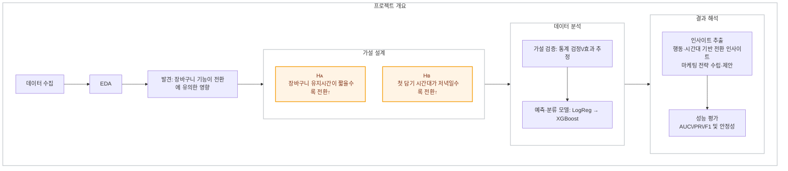

# 1️⃣ [프로젝트]**이커머스 데이터를 통한 장바구니 고객 행동 분석**

## 프로젝트 개요
| 항목             | 내용                                                                 |
|------------------|----------------------------------------------------------------------|
| 프로젝트 기간     | 2025.09 – 2025.12                                                    |
| 참여 인원        | 3명                                                                   |

## 참여인원 프로필

- 고성빈 : https://github.com/sbinhigher/sbinhigher
- 오새하 : `깃허브 링크`
- 김가현 : `깃허브 링크`

#### 🔍 프로젝트 분류  
`이커머스 데이터 분석(E-commerce Analytics)` · `전환율 예측(Conversion Prediction)` · `행동로그 분석(Behavior Analytics)`

#### 역할  
- 분석 설계 총괄: **가설(H1/H2) 수립 → 피처 엔지니어링 → 모델링 → 해석**  
- 실험 프레임 구축: **교차 검증** 및 **변수 중요도 vs 통계검정 결과** 정합성 점검  
- 데이터 품질·불균형 대응(언더/오버샘플링) 및 **지표체계(AUC/PR/F1)** 운용

#### 프로젝트 배경
- 장바구니 이탈이 높고, **룰 기반 타깃팅**만으로는 마케팅 효율 한계  
- 유저의 **담기 시간대/유지시간** 같은 행동 특성에 따라 전환률이 크게 달라질 수 있으나, 이를 정량 검증·예측하는 체계 부재

#### 문제 해결 방법
1. **가설 정립**:  
   - H1: 장바구니 **유지시간(`cart_duration`)** 이 짧을수록 전환↑  
   - H2: 장바구니 **첫 담기 시간대(`hour_first`)** 가 **저녁(18–22시)** 일수록 전환↑
2. **피처 엔지니어링(파생변수 생성)**:   `cart_duration`, `hour_first`, `weekday_first`, `view_count`, `cart_count`, `price_mean`, `category_main_freq`, `cart_to_view_ratio`, `session_duration_min`
3. **모델링(분류)**: 베이스라인 **Logistic Regression** → 보완모델 **XGBoost** 후보군 구성(세션 단위 전환 확률)  
4. **데이터 불균형 대응**: 언더/오버 샘플링, **train/test=70:30** 분할  
5. **교차 검증·해석**: 통계 검정 결과와 **변수 중요도(설명가능성)** 일치 여부로 가설 보강  
6. **운영 적용 설계**: 전환확률 스코어 기반 **캠페인/쿠폰 우선순위** 및 시간대별 캠페인 캘린더

#### 🚀 목표 및 성과 *(현 단계 기준)*  
| 항목 | 기존 | 개선 | 성과 |
|---|---|---|---|
| 타깃팅 전략 | 룰/일괄 캠페인 | **전환확률 기반 세그먼트** | 전환확률 스코어 산출 파이프라인 설계·구현 |
| 지표 관리 | 단일 정확도 중심 | **AUC, Precision/Recall, F1** 동시관리 | 전환/비전환 구분력 평가 지침 정립 |
| 가설 검증 | 정성적 추정 | **H1/H2 통계검정 + 모델 중요도 교차검증** | 분석 프레임 완성(일관성 체크 루틴) |
| 설명가능성 | 제한적 | **변수 중요도(예: 로지스틱 계수/트리계열 중요도)** | 마케팅 액션의 근거자료 확보(해석 리포트 템플릿) |

#### 데이터·피처(요약)
- **타깃**: 세션 단위 **구매 여부(1/0)**  
- **핵심 피처**: `cart_duration`(담기~구매/세션종료), `hour_first`(첫 이벤트 시), `cart_to_view_ratio` 등 행동·시간·상품 특성 피처 다층 설계

#### 모델·평가 체계
- **모델 후보**: Logistic Regression(베이스라인), XGBoost(비선형 보완)  
- **데이터셋**: train/test=70:30, 불균형 대응(under/over sampling)  
- **지표**: Accuracy(불균형 주의), **AUC(ROC)**, **Precision/Recall**, **F1**로 다면 평가(0.8 이상의 AUC를 실무 신뢰기준으로 채택)

#### Pain Point & 개선 방안
- **불균형 클래스** → PR 곡선·리프트/게인 차트 병행, 샘플링 및 임계값 튜닝  
- **시간 의존성/리크 위험** → 피처 생성 시 **사후 정보(미래 시점)** 유입 차단 규칙 명문화  
- **설명가능성 강화** → 계수 해석(로지스틱) + 트리계열 중요도/Partial Dependence로 교차 점검

#### 🛠️ 사용기술 및 툴(tool)

  
  
  
  
  
  

